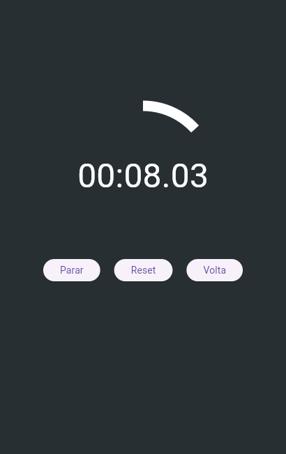

# Cronômetro Flutter




Este projeto implementa um **cronômetro simples** em Flutter, utilizando a arquitetura MVVM (Model-View-ViewModel). O cronômetro possui funcionalidades como **iniciar**, **parar**, **resetar** e **registrar voltas**, além de duas barras de progresso circulares que indicam o tempo decorrido, com animação suave a cada 16 milissegundos.

## Funcionalidades

- **Iniciar/Parar Cronômetro**: Controle a execução do cronômetro com botões de iniciar e parar.
- **Resetar**: Reseta o cronômetro e apaga todas as voltas registradas.
- **Registrar Voltas**: A cada volta registrada, o tempo da volta é salvo, permitindo que o usuário veja os tempos das voltas anteriores.
- **Barras de Progresso**: Exibe duas barras de progresso circulares que se atualizam suavemente a cada 16 milissegundos, com cores e comportamentos alternados dependendo do minuto atual.

## Funcionalidade das Barras de Progresso

- **Barra Inferior (Azul)**: Preenche toda a circunferência quando o minuto atual é ímpar e avança conforme o tempo decorrido quando o minuto é par.
- **Barra Superior (Branca)**: Fica vazia quando o minuto atual é par e vai se preenchendo conforme o tempo avança quando o minuto é ímpar.

## Pacotes Utilizados

Este projeto utiliza os seguintes pacotes:

- `provider`: Para gerenciar o estado de forma eficiente e usar a arquitetura MVVM.
- `flutter/material.dart`: Para construir a interface gráfica com widgets padrões do Flutter.
- `flutter/widgets.dart`: Para construção de widgets personalizados e layouts.
- `flutter/services.dart`: Para manipulação de eventos e interações com o sistema operacional.

## Estrutura do Projeto

- **viewmodel/cronometro_viewmodel.dart**: Contém a lógica do cronômetro e os métodos para controlar o estado do cronômetro, como iniciar, parar, resetar e registrar voltas.
- **view/cronometro_view.dart**: A tela principal do cronômetro, que exibe o tempo, as barras de progresso e os botões de controle.
- **widget/controles.dart**: Contém os botões de controle (Começar, Parar, Resetar, Volta).
- **widget/progress_bar.dart**: Define as barras de progresso circulares com "dicas planas".
- **model/cronometro_model.dart**: Representa o modelo de dados do cronômetro, incluindo o tempo decorrido, se o cronômetro está em execução, voltas e o estado das barras de progresso.

## Como Executar

### Pré-requisitos

1. **Flutter**: Certifique-se de que o Flutter está instalado na sua máquina. Se ainda não instalou, siga as instruções no [site oficial do Flutter](https://flutter.dev/docs/get-started/install).
2. **Editor**: Use um editor como o [VS Code](https://code.visualstudio.com/) ou o [Android Studio](https://developer.android.com/studio) para editar o código.

### Passos para Executar

1. Clone o repositório:
   ```bash
   git clone https://github.com/seu-usuario/cronometro-flutter.git
